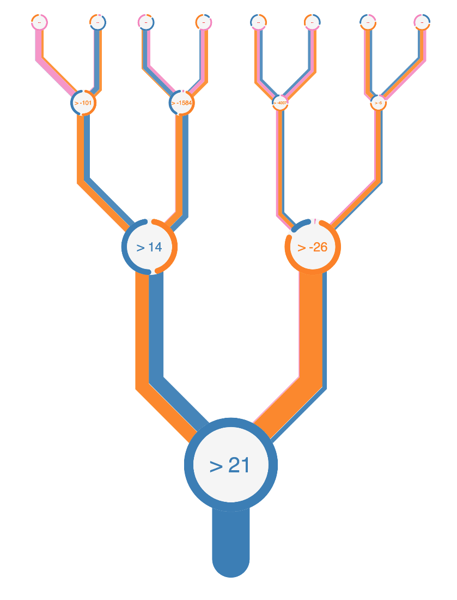

# DOI: <a href='https://zenodo.org/record/2579240'> </a>


# Written for usage in:


## "A machine learning based global sea-surface iodide distribution"

#### Authors:
Tomás Sherwen (1,2), Rosie J. Chance (2), Liselotte Tinel (2), Daniel Ellis (2), Mat J. Evans (1,2), and Lucy J. Carpenter (2)


(1) National Centre for Atmospheric Science, University of York, York, YO10 5DD, UK 
(2) Wolfson Atmospheric Chemistry Laboratories, University of York, York, YO10 5DD, UK

#### Citation:
Sherwen, T., Chance, R. J., Tinel, L., Ellis, D., Evans, M. J., and Carpenter, L. J.: A machine learning based global sea-surface iodide distribution, Earth Syst. Sci. Data Discuss., https://doi.org/10.5194/essd-2019-40, in review, 2019.

# Running
Place files in csv folder.

`python start.py $NCPUS` -for composite files
`python start.py $NCPUS 1 ` -for single dot files

This then runs in the background (no screen). To change edit 'show' option in main.js

# Set colours
see colours.json file

# Output
This is in the pdf folder.

# Install
```
conda install nodejs
npm install
sudo npm install -g --save electron --unsafe-perm=true --allow-root
```

- for merge - have imagemagick and ghostscript installed


# Montage setup
python montage.py


## Example Output for Composite Graph



